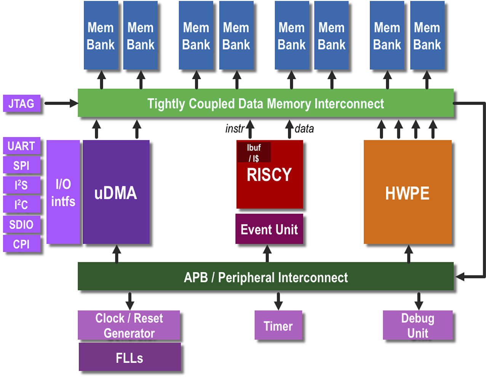

# PULPissimo

## Citing
If you are using the PULPissimo IPs for an academic publication, please cite the following paper:

```
@INPROCEEDINGS{8640145,
  author={Schiavone, Pasquale Davide and Rossi, Davide and Pullini, Antonio and Di Mauro, Alfio and Conti, Francesco and Benini, Luca},
  booktitle={2018 IEEE SOI-3D-Subthreshold Microelectronics Technology Unified Conference (S3S)}, 
  title={Quentin: an Ultra-Low-Power PULPissimo SoC in 22nm FDX}, 
  year={2018},
  volume={},
  number={},
  pages={1-3},
  doi={10.1109/S3S.2018.8640145}}
```



PULPissimo is the microcontroller architecture of the more recent PULP chips,
part of the ongoing "PULP platform" collaboration between ETH Zurich and the
University of Bologna - started in 2013.

PULPissimo, like PULPino, is a single-core platform. However, it represents a
significant step ahead in terms of completeness and complexity with respect to
PULPino - in fact, the PULPissimo system is used as the main System-on-Chip
controller for all recent multi-core PULP chips, taking care of autonomous I/O,
advanced data pre-processing, external interrupts, etc.
The PULPissimo architecture includes:

- Either the RI5CY core or the Ibex one as main core
- Autonomous Input/Output subsystem (uDMA)
- New memory subsystem
- Support for Hardware Processing Engines (HWPEs)
- New simple interrupt controller
- New peripherals
- New SDK

RISCY is an in-order, single-issue core with 4 pipeline stages and it has
an IPC close to 1, full support for the base integer instruction set (RV32I),
compressed instructions (RV32C) and multiplication instruction set extension
(RV32M). It can be configured to have single-precision floating-point
instruction set extension (RV32F). It implements several ISA extensions
such as: hardware loops, post-incrementing load and store instructions,
bit-manipulation instructions, MAC operations, support fixed-point operations,
packed-SIMD instructions and the dot product. It has been designed to increase
the energy efficiency of in ultra-low-power signal processing applications.
RISCY implementes a subset of the 1.10 privileged specification.
It includes an optional PMP and the possibility to have a subset of the USER MODE.
RISCY implement the RISC-V Debug spec 0.13.
Further information about the core can be found at
http://ieeexplore.ieee.org/abstract/document/7864441/
and in the documentation of the IP.

Ibex, formely Zero-riscy, is an in-order, single-issue core with 2 pipeline
stages. It has full support for the base integer instruction set (RV32I
version 2.1) and compressed instructions (RV32C version 2.0).
It can be configured to support the multiplication instruction set extension
(RV32M version 2.0) and the reduced number of registers extension (RV32E
version 1.9). Ibex implementes the Machine ISA version 1.11 and has RISC-V
External Debug Support version 0.13.2. Ibex has been originally designed at
ETH to target ultra-low-power and ultra-low-area constraints. Ibex is now
maintained and further developed by the non-for-profit community interest
company lowRISC. Further information about the core can be found at
http://ieeexplore.ieee.org/document/8106976/
and in the documentation of the IP at
https://ibex-core.readthedocs.io/en/latest/index.html

PULPissimo includes a new efficient I/O subsystem via a uDMA (micro-DMA) which
communicates with the peripherals autonomously. The core just needs to program
the uDMA and wait for it to handle the transfer.
Further information about the core can be found at
http://ieeexplore.ieee.org/document/8106971/
and in the documentation of the IP.

PULPissimo supports I/O on interfaces such as:

- SPI (as master)
- I2S
- Camera Interface (CPI)
- I2C
- UART
- Hyperbus
- JTAG

PULPissimo also supports integration of hardware accelerators (Hardware
Processing Engines) that share memory with the RI5CY core and are programmed on
the memory map. An example accelerator, performing multiply-accumulate on a
vector of fixed-point values, can be found in `ips/hwpe-mac-engine` (after
updating the IPs: see below in the Getting Started section).
The `ips/hwpe-stream` and `ips/hwpe-ctrl` folders contain the IPs necessary to
plug streaming accelerators into a PULPissimo or PULP system on the data and
control plane.
For further information on how to design and integrate such accelerators,
see `ips/hwpe-stream/doc` and https://arxiv.org/abs/1612.05974.

## Documentation

- The [datasheet](doc/datasheet/datasheet.pdf) contains details about Memory Map, Peripherals, Registers etc. This may not be fully up-to-date.
- PULPissimo was presented at the Week of Open Source Hardware (WOSH) 2019 at ETH Zurich.
  - [Slides](https://pulp-platform.org/docs/riscv_workshop_zurich/schiavone_wosh2019_tutorial.pdf)
  - [Video](https://www.youtube.com/watch?v=27tndT6cBH0)

## Getting Started
We provide a [simple runtime](#simple-runtime) and a [full featured
runtime](#software-development-kit) for PULPissimo. We recommend you try out
first the minimal runtime and when you hit its limitations you can try the full
runtime by installing the SDK.

After having chosen a runtime you can run software by either [simulating the
hardware](#building-the-rtl-simulation-platform) or running it in a [software
emulation](#building-and-using-the-virtual-platform).

### Prerequisites
PULPissimo is a Microcontroller provided in SystemVerilog RTL description. As such,
it can be used and evaluated with many different tools. Out of the box, we provide Makefile
targets for RTL simulation with Mentor Questa SIM (Intel/Altera Modelsim is not supported at the moment)
and Cadence Xcelium. Being purely written in SystemVerilog, in theory the whole design can be simulated 
with any RTL simulator with (deccent!) SystemVerilog support. While an open source simulation target is 
definitely on our wish- and todo-list (e.g. out-of-the box support for Verilator), this currently
still requires more extensive modifications to the RTL and scripts.

For FPGA implementation (see [FPGA Section](#FPGA)) we generate ready-made scripts for Synthesis and Implementation 
for Xilinx Vivado for a number of different development boards.

### Simple Runtime
The simple runtime is here to get you started quickly. Using it can run and
write programs that don't need any advanced features.

First install the system dependencies indicated
[here](https://github.com/pulp-platform/pulp-runtime/blob/master/README.md)

Then make sure you have
[riscv-gnu-toolchain](https://github.com/pulp-platform/riscv-gnu-toolchain)
installed (either by compiling it or using one of the binary releases under
available under the release tab) and point `PULP_RISCV_GCC_TOOLCHAIN` to it:

```
export PULP_RISCV_GCC_TOOLCHAIN=YOUR_PULP_TOOLCHAIN_PATH
```
Add the pulp-toolchain to your PATH variable:

```
export PATH=$PULP_RISCV_GCC_TOOLCHAIN/bin:$PATH
```


The repository for the simple runtime is included as a submodule:
```
git submodule update --init --recursive
```
The simple runtime supports many different hardware configurations. We want PULPissimo.

```
cd sw/pulp-runtime
```
Then, to use the CV32E40P (formely RI5CY) core, type:

```
source configs/pulpissimo_cv32.sh
```

or to use the Ibex (formely zero-riscy) core:

```
source configs/pulpissimo_ibex.sh
```


Now we are ready to set up the simulation environment. Normally you would want
to simulate the hardware design running your program, so go
[here](#building-the-rtl-simulation-platform).

### PULP FreeRTOS
PULP FreeRTOS allows you to build applications using the FreeRTOS kernel. You
can also choose to not use the FreeRTOS kernel and build a baremetal
application, though in that case driver support is not yet fully fleshed out.

First make sure you have
[riscv-gnu-toolchain](https://github.com/pulp-platform/riscv-gnu-toolchain)
installed (either by compiling it or using one of the binary releases under
available under the release tab) and point your `RISCV` environment variable to
it.

Also we need to set up the simulation environment. Normally you would want to
simulate the hardware design running your program, so go
[here](#building-the-rtl-simulation-platform) to do that.


Then get the repository for the pulp-freertos:
```
git clone https://github.com/pulp-platform/pulp-freertos/ sw/pulp-freertos
```

There are multiple hardware configuration supported. Select PULPissimo using the
CV32E40P core.
So enter the directory of pulp-freertos:

```
cd sw/pulp-freertos
```

and select the correct configuration:

```
source env/pulpissimo-cv32e40p.sh
```

You then can run a simple freertos hello world like this:

```
cd tests/hello_world_pmsis
make all run
```

There are other tests in `tests/` you can run.

### ~~Software Development Kit~~ (UNSUPPORTED WITH CURRENT RELEASE)

If you need a more complete runtime (drivers, tasks etc.) you can install the
software development kit for PULP/PULPissimo.

First install the system dependencies indicated
[here](https://github.com/pulp-platform/pulp-builder/blob/master/README.md)

In particular don't forget to set `PULP_RISCV_GCC_TOOLCHAIN`.

You can now either follow the steps outlined [here](https://github.com/pulp-platform/pulp-sdk/#standard-sdk-build)
to build the full sdk or install these python dependencies
```
pip3 install --user artifactory twisted prettytable sqlalchemy pyelftools 'openpyxl==2.6.4' xlsxwriter pyyaml numpy configparser pyvcd sphinx
```
and just call
```
make build-pulp-sdk
```
and then set up the necessary environment variables with
```
source env/pulpissimo.sh
```

There exists a bug in GCC 11.1.0 which fails the sdk build with the error `'this' pointer is null [-Werror=nonnull]`.
If you encounter this bug use the following temporary workaround instead to build the SDK:

```
VP_WORKAROUND_NONNULL_BUG=yes make build-pulp-sdk
```

### Building the RTL simulation platform
Note you need Questasim or Xcelium to do an RTL simulation of PULPissimo
(verilator support planned, but not finished). Intel Modelsim for Intel FPGAs
does *not* work.

To build the RTL simulation platform, start by getting the latest version of the
IPs composing the PULP system:
```bash
make checkout
```

This will download all the required IPs, solve dependencies and generate the
scripts. The dependency management tool is
[Bender](https://github.com/pulp-platform/bender).

After having access to the SDK, you can build the simulation platform by doing
the following:
```bash
make build
```
This command builds a version of the simulation platform with no dependencies on
external models for peripherals. See below (Proprietary verification IPs) for
details on how to plug in some models of real SPI, I2C, I2S peripherals.

For more advanced usage have a look at `./utils/bin/bender --help` for bender.


Also check out the output of `make help` for more useful Makefile targets.

### Developing your own RTL
#### Bender How To
With Bender developing on top of PULPissimo is getting a lot easier. The command
line tool is installed in the project root directory if you invoke `make
checkout`. It performs dependency resolution according to a manifest
file called `Bender.yml`. The file lists all source files of the RTL project as
well as its direct dependencies. Bender can be used to generate source file
lists for various different tools for simulation, ASIC/FPGA synthesis etc. Have
a look at the Bender [project
documentation](https://github.com/pulp-platform/bender) if you want to know more
about it. For now we will concentrate on the most important steps when
developing on PULPissimo using Bender.

#### Where are all the sub IPs (dependencies)?
Bender checks out the sub-ips in a hidden directory called
`.bender/git/checkouts`. **You are not supposed to change the files in this
directory.** If you want to get the path of a specific IP, call `./bender path
<some ip (e.g. axi)>` to get the relative path to an IP. To list all IPs in the
project, call `./bender packages -f`.

#### Modifying an existing IP
The hidden bender directory is not the location to introduce changes to the RTL
of sub-ips. If you want to quickly try out changes to a sub-ip, call `./bender
clone <ip_name>` to checkout a working copy of the ip into a directory called
`working_dir`. Call `make scripts` to update the source files in the scripts.
Afterwards, every change you make in the RTL of this working copy will be
incorporated into the RTL simulation model (once you recompile it with
`make build`) and the FPGA build (once you synthesize it).

#### Adding a new IP to PULPissimo
If you want to add new IPs to pulpissimo you most likely will have to fork the
`pulp_soc` sub-ip since this is the main repository that contains most of the
SoCs RTL logic. Thus, follow the steps above to create a working copy of
pulp_soc. Then you can either add your additional source code directly to
`pulp_soc`s source tree or, preferably, create a new repository with your source
code, register the RTL source files in a `Bender.yml` manifest file and add this
new repository as a dependency to `pulp_soc`'s `Bender.yml`. Then you are free
to instantiate your new IP somewhere within pulp_soc. We make excessive use of
this strategy throughout the pulpissimo project which is a collection of many
different IP repositories.


### Downloading and running examples
Finally, you can download and run examples; for that you can checkout the following repositories depending on whether you use the simple runtime or the full sdk.

Simple Runtime: https://github.com/pulp-platform/pulp-runtime-examples

SDK: https://github.com/pulp-platform/pulp-rt-examples

Now you can change directory to your favourite test e.g.: for an hello world
test for the SDK, run
```bash
cd pulp-rt-examples/hello
make clean all run
```
or for the Simple Runtime:

```bash
cd pulp-runtime-examples/hello
make clean all run
```

If you want to change the compiler flags, as for example 
if you are using CV32E40P with the XPULP extensions but you want to compile 
using only the RV32IMC instructions to compare performance,
you can modify the Makefile inside the pulp-runtime-examples/hello folder adding:

```
PULP_ARCH_CFLAGS    =  -march=rv32imc -DRV_ISA_RV32
PULP_ARCH_LDFLAGS   =  -march=rv32imc
PULP_ARCH_OBJDFLAGS = -Mmarch=rv32imc
```
The open-source simulation platform relies on JTAG to emulate preloading of the
PULP L2 memory. If you want to simulate a more realistic scenario (e.g.
accessing an external SPI Flash), look at the sections below.

In case you want to see the Modelsim GUI, just type
```bash
make run gui=1
```
before starting the simulation.

If you want to save a (compressed) VCD for further examination, type
```bash
make run vsim/script=export_run.tcl
```
before starting the simulation. You will find the VCD in
`build/<SRC_FILE_NAME>/pulpissimo/export.vcd.gz` where
`<SRC_FILE_NAME>` is the name of the C source of the test.

### Building and using the virtual platform
The virtual platform is a software-only model of the PULPissimo SoC (and also of
other related SoCs). While a simulation of the hardware design is accurate it is
also very very slow. The virtual platform helps you develop software quicker by
providing a more or less accurate software-model of PULPissimo.

Once the sdk is installed, the following commands can be executed in the sdk
directory to use the virtual platform:
```bash
source sourceme.sh
source configs/platform-gvsoc.sh
```

Then tests can be compiled and run as for the RTL platform. When switching from
one platform to another, it may be needed to regenrate the test configuration
with this command:
```bash
make conf
```

More information is available in the documentation here: pulp-builder/install/doc/vp/index.html

### Updating the bootrom
You can customize the bootrom, have a look at the `sw/bootcode/` directory. To
import your changed version of the boot code into PULPissimo, just call
```
make bootrom
```

## FPGA

PULPissimo has been implemented on FPGA for the various Xilinx FPGA boards.

### Supported Boards
At the moment the following boards are supported:
* Digilent Genesys2
* Xilinx ZCU104
* Xilinx ZCU102
* Xilinx VCU108
* Digilent Nexys Board Family
* ZedBoard

In the release section you find precompiled bitstreams for all of the above
mentionied boards. If you want to use the latest development version PULPissimo
follow the section below to generate the bitstreams yourself.

### Bitstream Generation
In order to generate the PULPissimo bitstream for a supported target FPGA board
you can directly generate the bitstream for the desired board by running the
corresponding make target.

This will parse the `Bender.yml` using the PULP bender dependency management tool to
generate tcl scripts for all the IPs used in the PULPissimo project. These files
are later on sourced by Vivado to generate the bitstream for PULPissimo.

You can also switch to the fpga subdirectory and start the apropriate make target to
generate the bitstream:

```Shell
cd target/fpga
make <board_target>
```
In order to show a list of all available board targets call:

```Shell
make help
```

This process might take a while. If everything goes well your fpga directory
should now contain two files:

- `pulpissimo_<board_target>.bit` the bitstream file for JTAG configuration of
  the FPGA.
- `pulpissimo_<board_target>.bin` the binary configuration file to flash to a
  non-volatile configuration memory.


If your invocation command to start Vivado isn't `vivado` you can use the Make
variable `VIVADO` to specify the right command (e.g. `make genesys2
VIVADO='vitis vivado'` for ETH Almalinux machines.) Boot from ROM is not
available yet. The ROM will always return the `jal x0,0` to trap the core until
the debug module takes over control and loads the programm into L2 memory. Once
the bitstream `pulpissimo_genesys2.bit` is generated in the fpga folder, you can
open Vivado `vivado` (we tried the 2018.3 version) and load the bitstream into
the fpga or use the Configuration File (`pulpissimo_genesys2.bin`) to flash it
to the on-board Configuration Memory.

### Bitstream Flashing
Start Vivado then:

```
Open Hardware Manager
Open Target
Program device
```

Now your FPGA is ready to emulate PULPissimo!

### Board Specific Information
Have a look at the board specific README.md files in
`target/fpga/pulpissimo-<board_target>/README.md` for a description of peripheral
mappings and default clock frequencies.

### Compiling Applications for the FPGA Target
To run or debug applications for the FPGA you need to use a recent version of
the PULP-SDK (commit id 3256fe7 or newer.'). Configure the SDK for the FPGA
platform by running the following commands within the SDK's root directory:

```Shell
source configs/pulpissimo.sh
source configs/fpgas/pulpissimo/<board_target>.sh
```
**Currently, the only available board_target in the SDK is the genesys2.sh board. However, there are no board specific settings in this file except for the clock frequency and UART baudrate that can easily be overidden (see below). You can just source the genesys2.sh target regardless of which FPGA board you are actually using and override the frequencies and baudrate in your application. The only reason you need to source the genesys2.sh configuration file instead of e.g. the rtl platform configuration is to instruct the SDK to omit all runtime initialization (the code executed before your main function is called on the core) of the FLLs that are not available in the FPGA version of PULPissimo.**

If you updated the SDK don't forget to recompile the SDK and the dependencies.

In order for the SDK to be able to configure clock dividers (e.g. the ones for
the UART module) to the right values it needs to know which frequencies
PULPissimo is running at. You can find the default frequencies in the above
mentioned board specific README files.

In our application we need to override two weakly defined variables in our
source code to configure the SDK to use these frequencies:
```C
#include <stdio.h>
#include <rt/rt_api.h>

int __rt_fpga_fc_frequency = <Core Frequency> // e.g. 20000000 for 20MHz;
int __rt_fpga_periph_frequency = <SoC Frequency> // e.g. 10000000 for 10MHz;

int main()
{
...
}
```

By default, the baudrate of the UART is set to `115200`.

Add the following global variable declaration to your application in case
you want to change it:

```C
unsigned int __rt_iodev_uart_baudrate = your baudrate;
```

Compile your application with

```Shell
make clean all
```

This command builds the ELF binary with UART as the default io peripheral.
The binary will be stored at `build/pulpissimo/[app_name]/[app_name]`.

### Core selection
By default, PULPissimo is configured to use the RI5CY core with floating-point
support being enabled. To switch to Ibex (and disable floating-point support),
the following steps need to be performed.

1. Switch hardware configuration

   Open the file `fpga/pulpissimo-<board_target>/rtl/xilinx_pulpissimo.v` and
   change the `CORE_TYPE` parameter to the preferred value. Change the value
   of the `USE_FPU` parameter from `1` to `0`. Save the file and regenerate
   the FPGA bitstream.

2. Switch SDK configuration

   Instead of sourcing `configs/pulpissimo.sh` when configuring the SDK,
   source `configs/pulpissimo_ibex.sh`.

### GDB and OpenOCD
In order to execute our application on the FPGA we need to load the binary into
PULPissimo's L2 memory. To do so we can use OpenOCD in conjunction with GDB to
communicate with the internal RISC-V debug module.

PULPissimo uses JTAG as a communication channel between OpenOCD and the Core.
Have a look at the board specific README file on how to connect your PC with
PULPissimo's JTAG port.

Due to a long outstanding issue in the RISC-V OpenOCD project (issue #359) the
riscv/riscv-openocd does not work with PULPissimo. However there is a small
workaround that we incorporated in a patched version of openocd. If you have
access to the artifactory server, the patched openocd binary is installed by
default with the `make deps` command in the SDK. If you don't have access to the
precompiled binaries you can automatically download and compile the patched
OPENOCD from source. You will need to install the following dependencies on your
machine before you can compile OpenOCD:

- `autoconf` >= 2.64
- `automake` >= 1.14
- `texinfo`
- `make`
- `libtool`
- `pkg-config` >= 0.23 (or compatible)
- `libusb-1.0`
- `libftdi`
- `libusb-0.1` or `libusb-compat-0.1` for some older drivers

After installing those dependecies with you OS' package manager you can
download, apply the patch and compile OpenOCD with:

```Shell
source sourceme.sh && ./pulp-tools/bin/plpbuild checkout build --p openocd --stdout
```

The SDK will automatically set the environment variable `OPENOCD` to the
installation path of this patched version.

Launch openocd with one of the provided or your own configuration file for the
target board as an argument.

E.g.:

```Shell
$OPENOCD/bin/openocd -f pulpissimo/fpga/pulpissimo-genesys2/openocd-genesys2.cfg
```
In a seperate terminal launch gdb from your `pulp_riscv_gcc` installation passing
the ELF file as an argument with:

`$PULP_RISCV_GCC_TOOLCHAIN_CI/bin/riscv32-unknown-elf-gdb  PATH_TO_YOUR_ELF_FILE`

In gdb, run:

```
(gdb) target remote localhost:3333
```

to connect to the OpenOCD server.

In a third terminal launch a serial port client (e.g. `screen` or `minicom`) on
Linux to riderect the UART output from PULPissimo with e.g.:

```Shell
screen /dev/ttyUSB0 115200
```

the ttyUSB0 target may change.

Now you are ready to debug!

In gdb, load the program into L2:

```
(gdb) load
```
and run the programm:

```
(gdb) continue
```
Of course you can also benefit from the debug capabilities that GDB provides.

E.g. see the disasembled binary:
```
(gdb) disas
```
List the current C function, set a break point at line 25, continue and have fun!

```
(gdb) list
21
22  int main()
23  {
24    while (1) {
25      printf("Hello World!\n\r");
26     for (volatile int i=0; i<1000000; i++);
27    }
28    return 0;
29  }

(gdb) b 25
Breakpoint 1 at 0x1c0083d2: file test.c, line 25.
(gdb) c
Continuing.

Breakpoint 1, main () at test.c:25
25      printf("Hello World!\n\r");


(gdb) disas
Dump of assembler code for function main:
   0x1c0083d4 <+22>:    li  a1,1
   0x1c0083d6 <+24>:    blt s0,a5,0x1c0083e8 <main+42>
=> 0x1c0083da <+28>:    lw  a5,12(sp)
   0x1c0083dc <+30>:    slli    a1,a1,0x1
   0x1c0083de <+32>:    addi    a5,a5,1
   0x1c0083e0 <+34>:    sw  a5,12(sp)

(gdb) monitor reg a5
a5 (/32): 0x000075B7

```
Not all gdb commands work as expected on the riscv-dbg target.
To get a list of available gdb commands execute:
```
monitor help
```

Most notably the command `info registers` does not work. Use `monitor reg`
instead which has the same effect.


## Proprietary verification IPs
The full simulation platform can take advantage of a few models of commercial
SPI, I2C, I2S peripherals to attach to the open-source PULP simulation platform.
In `target/sim/vip/spi_flash`, `target/sim/vip/i2c_eeprom`, `target/sim/vip/i2s`
you find the instructions to install SPI, I2C and I2S models.

When the SPI flash model is installed, it will be possible to switch to a more
realistic boot simulation, where the internal ROM of PULP is used to perform an
initial boot and to start to autonomously fetch the program from the SPI flash.
To do this, the `LOAD_L2` parameter of the testbench has to be switched from
`JTAG` to `STANDALONE`.

## PULP platform structure
After being fully setup as explained in the Getting Started section, this root
repository is structured as follows:
- `target/sim/tb` contains the main platform testbench and the related files.
- `target/sim/vip` contains the verification IPs used to emulate external peripherals,
  e.g. SPI flash and camera.
- `hw` could also contain other material (e.g. global includes, top-level
  files)
- `target/sim/questasim` contains the ModelSim/QuestaSim simulation platform.
- `sw/pulp-runtime` contains the PULP runtime; `sw/regression_tests`
  contains some tests released with the SDK or runtime. Some tests, especially
  parallel tests, are not compatible with PULPissimo.
- `Bender.yml` contains the package information used with bender. This includes
  a list of IPs required and source files contained within this repository.
- When using bender, other files may be relevant: `Bender.local` contains
  configs for bender, including overrides for dependencies, `Bender.lock` is a
  generated file used by bender, `utils/bin/bender` is the bender executable
  fetched by the makefile, `.bender` directory contains the database and
  checkouts used by bender.

## Requirements
The RTL platform has the following requirements:
- Relatively recent Linux-based operating system; we tested *Ubuntu 16.04*,
  *CentOS 7*, and *Almalinux 8*.
- QuestaSim in reasonably recent version (we tested it with version *2023.4*
-- the free version provided by Altera is only partially working, see issue #12).
- Python 3.4, with the `pyyaml` module installed (you can get that with
  `pip3 install pyyaml`).
- The SDK has its own dependencies, listed in
  https://github.com/pulp-platform/pulp-sdk/blob/master/README.md
- You will need the minicom command line application to view UART output in case
  you use the 'run' Makefile target with the FPGA platform (discouraged, you
  better use the approach outlined above)

## External contributions
The supported way to provide external contributions is by forking one of our
repositories, applying your patch and submitting a pull request where you
describe your changes in detail, along with motivations.
The pull request will be evaluated and checked with our regression test suite
for possible integration.
If you want to replace our version of an IP with your GitHub fork, just 
update the Bender.yml file and run `./utils/bin/bender update`.
While we are quite relaxed in terms of coding style, please try to follow these
recommendations:
https://github.com/pulp-platform/ariane/blob/master/CONTRIBUTING.md

## Known issues

## Support & Questions
For support on any issue related to this platform or any of the IPs, please add
an issue to our tracker on https://github.com/pulp-platform/pulpissimo/issues

